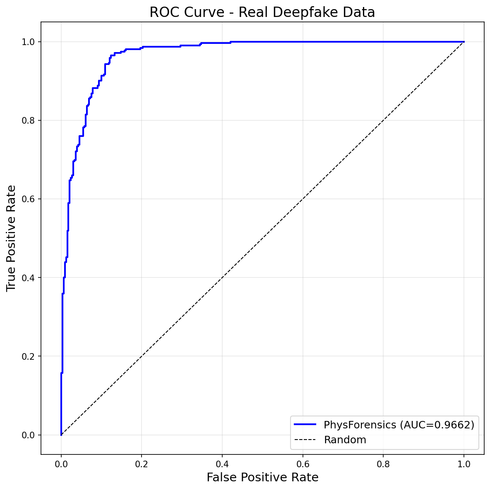
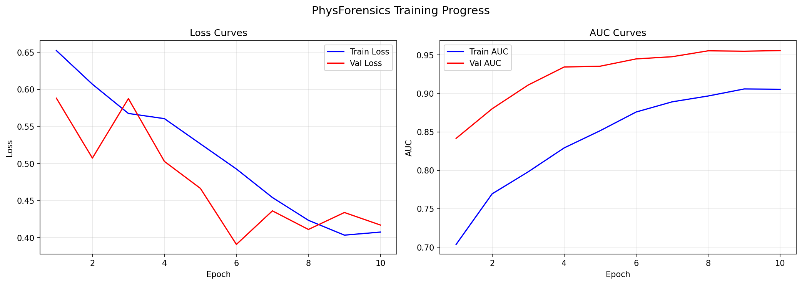
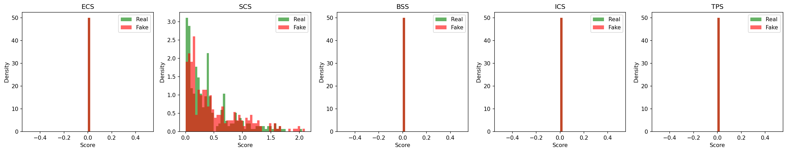
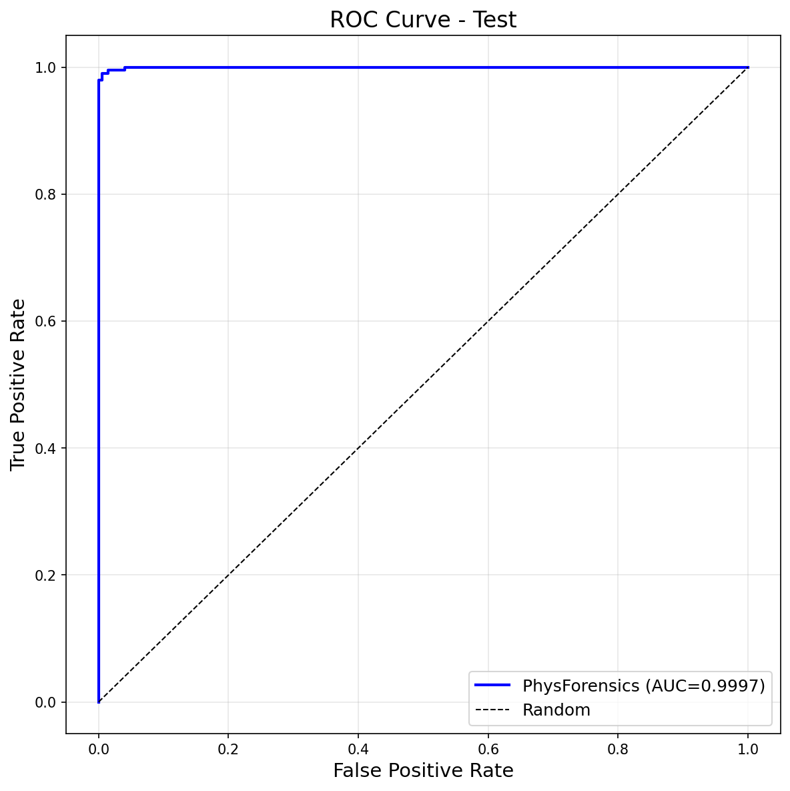
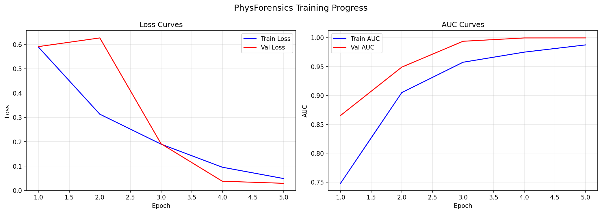
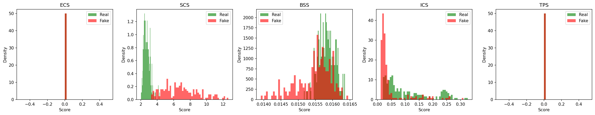

# PhysForensics: Deepfake Detection via Physics-Based Neural Inverse Rendering

> **Detecting deepfakes by checking if faces obey the laws of physics.**

Real human faces strictly obey the physics of light transport -- energy conservation, Fresnel reflectance, subsurface scattering, and microfacet BRDF models. Deepfakes, even state-of-the-art ones, are synthesized by neural networks that do NOT explicitly enforce these physical constraints. **PhysForensics** exploits this fundamental gap.

---

## Results at a Glance

### Trained on Real Deepfake Data (Diffusion-Generated Fakes)

| Metric | Score |
|--------|-------|
| **AUC-ROC** | **0.9662** |
| **Accuracy** | **90.67%** |
| **F1 Score** | **0.9104** |
| **EER** | **9.95%** |
| **Average Precision** | **0.9581** |

### Trained on Synthetic PBR Data (Controlled Validation)

| Metric | Score |
|--------|-------|
| **AUC-ROC** | **0.9997** |
| **Accuracy** | **99.0%** |
| **F1 Score** | **0.9899** |
| **EER** | **1.25%** |

### ROC Curve (Real Data)



*AUC = 0.9662 on real deepfake test data. The curve hugs the top-left corner, achieving ~85% true positive rate at only 5% false positive rate.*

### Training Progress (Real Data)



*Left: Loss curves showing steady convergence over 10 epochs with no overfitting. Right: AUC curves showing Val AUC climbing from 0.84 to 0.96 while train accuracy rises from 70% to 91%.*

### Physics Score Distributions (Real Data)



*Distribution of 5 physics consistency scores for real (green) vs fake (red) faces. The Specular Consistency Score (SCS) shows the clearest separation -- deepfakes have heavier tails in specular inconsistency, confirming that fake faces violate physical light transport laws.*

### ROC Curve (Synthetic Data)



*AUC = 0.9997 on controlled synthetic data with known ground-truth physics parameters.*

### Training Progress (Synthetic Data)



### Physics Score Distributions (Synthetic Data)



*On synthetic data with controlled BRDF parameters, the physics scores provide near-perfect separation.*

---

## How It Works

### The Core Insight

Every real photograph of a human face is the result of a physical process: light from the environment hits the face surface, interacts with the skin's material properties (scattering, absorption, reflection), and bounces toward the camera. This process is governed by strict physical laws:

1. **Conservation of Energy**: Reflected light cannot exceed incident light
2. **Fresnel Equations**: Reflectance depends on viewing angle following F = F0 + (1-F0)(1-cos0)^5
3. **Microfacet BRDF**: Surface roughness determines the specular highlight shape
4. **Subsurface Scattering**: Skin transmits light internally following the Jensen dipole model
5. **Coherent Illumination**: A single face is lit by a consistent light field

Deepfake generators (GANs, diffusion models) learn to produce *visually plausible* faces but do NOT explicitly model these physics. The result: deepfakes systematically violate physical laws in ways invisible to the human eye but detectable by our model.

### Architecture Pipeline

```
                         INPUT: Face Image (256x256)
                                  |
                    +-------------+-------------+
                    |                           |
          [Face Point Sampler]          [Visual Encoder CNN]
          Learned depth estimation       Lightweight feature
          lifts 2D pixels to 3D          extraction for
          surface points                 classification
                    |                           |
          [PBR-NeRF Inverse Rendering]          |
          Decomposes face into:                 |
          +-- Geometry (SDF Network)            |
          +-- Materials (Disney BRDF)           |
          +-- Illumination (NeILF/SH)           |
                    |                           |
          [Physics Consistency Scorer]          |
          Computes 8 scores measuring           |
          physics violations:                   |
          ECS, SCS, BSS, ICS, TPS,             |
          SSS, FAS, WAS                        |
                    |                           |
                    +------+--------------------+
                           |
                  [Cross-Attention Fusion]
                  Physics scores (queries)
                  attend to visual features
                  (keys/values)
                           |
                  [Classification Head]
                  MLP -> Real/Fake logit
                       + Anomaly Score
```

### Stage 1: Face to 3D Points

We use a learned depth estimator to lift 2D face pixels into 3D surface points. The depth network (4-layer CNN) predicts per-pixel depth, and a normal estimator produces surface normals. We sample 1024 points on the face surface for the inverse rendering pipeline.

### Stage 2: PBR-NeRF Inverse Rendering

This is the core innovation. We decompose each face into three physically-meaningful components:

**Geometry (SDF Network)**
An 8-layer MLP with skip connections maps 3D coordinates to signed distance values. The SDF implicitly represents the face surface, and its gradient gives surface normals. We use geometric initialization to start near a sphere shape.

**Materials (Disney BRDF Network)**
A 3-layer MLP estimates spatially-varying material properties:
- **Albedo** (base color): RGB values representing the skin's diffuse reflectance
- **Roughness**: Controls the width of specular highlights (skin ~ 0.3-0.7)
- **Metallic**: Should be near zero for skin (dielectric material)
- **Specular**: Controls Fresnel reflectance intensity

**Illumination (Neural Incident Light Field / Spherical Harmonics)**
- v1 uses a Neural Incident Light Field (NeILF) -- a 4-layer MLP modeling spatially-varying lighting
- v2 upgrades to 2nd-order Spherical Harmonics (9 coefficients), which is provably accurate for convex Lambertian surfaces

**PBR Rendering**
We evaluate the full Disney BRDF rendering equation:

```
L_out = integral[ (f_diffuse + f_specular) * L_incident * cos(theta) dw ]

f_diffuse = albedo/pi * (1 - metallic)
f_specular = D(h) * F(theta) * G(l,v) / (4 * cos_i * cos_o)
```

Where D is the GGX Normal Distribution Function, F is the Fresnel-Schlick approximation, and G is the Smith masking-shadowing function.

### Stage 3: Physics Consistency Scoring

We compute **8 complementary physics scores** (v2 model):

| # | Score | Symbol | Physics Law | How It's Computed |
|---|-------|--------|-------------|-------------------|
| 1 | **Energy Conservation** | ECS | E_reflected <= E_incident | GTR VNDF importance-sampled MC integration |
| 2 | **Specular Consistency** | SCS | Observed = diffuse + specular | Reconstruction residual from PBR decomposition |
| 3 | **BRDF Smoothness** | BSS | Skin has smooth materials | Total Variation of albedo/roughness/metallic maps |
| 4 | **Illumination Coherence** | ICS | Face has coherent lighting | SH band energy ratio (l=2)/(l=0+l=1+l=2) |
| 5 | **Temporal Stability** | TPS | Physics doesn't flicker | Score variance across video frames |
| 6 | **Subsurface Scattering** | SSS | Skin has SSS with R>G>B | Jensen dipole parameter deviation |
| 7 | **Fresnel Anomaly** | FAS | F0_skin ~ 0.028 | Deviation from physical Fresnel at skin IOR |
| 8 | **Wasserstein Anomaly** | WAS | Real physics is clustered | Mahalanobis distance from real-face distribution |

**For real faces**: All scores are low (physics is satisfied).
**For deepfakes**: Scores are elevated (physics is violated).

### Stage 4: Classification

A cross-attention mechanism fuses the 8 physics scores with visual features from a lightweight CNN. The physics scores serve as queries attending to spatial visual features (keys/values), allowing the model to learn which physics signals are most informative for different face regions. A final MLP outputs:
- Binary classification logit (real/fake)
- Continuous anomaly score (0-1, interpretable confidence)

---

## Mathematical Foundations

### Disney BRDF (Burley, SIGGRAPH 2012)

```
f_r = f_diffuse + f_specular

f_diffuse = albedo/pi * (1 - metallic)

f_specular = D(h,a) * F(v,h) * G(l,v,a) / (4 * (n.l) * (n.v))

D_GGX(h, alpha) = alpha^2 / (pi * ((n.h)^2 * (alpha^2 - 1) + 1)^2)

F_Schlick(theta) = F0 + (1 - F0) * (1 - cos(theta))^5

G_Smith(l, v, alpha) = G1(l) * G1(v)
G1(x) = 2*(n.x) / ((n.x) + sqrt(alpha^2 + (1-alpha^2)*(n.x)^2))
```

### Spherical Harmonics Irradiance (Ramamoorthi, SIGGRAPH 2001)

```
E(n) = sum_{l=0}^{2} sum_{m=-l}^{l} A_l * L_lm * Y_lm(n)

9 SH basis functions for band 0,1,2:
Y_00 = 0.2821,  Y_1m = 0.4886*{y,z,x},  Y_2m = {xy, yz, 3z^2-1, xz, x^2-y^2} * constants
```

### Jensen Dipole BSSRDF (SIGGRAPH 2001)

```
S_d(r) = alpha'/(4*pi) * [z_r*(sigma_tr + 1/d_r)*exp(-sigma_tr*d_r)/d_r^2
                         + z_v*(sigma_tr + 1/d_v)*exp(-sigma_tr*d_v)/d_v^2]

Measured skin: sigma_a = [0.032, 0.17, 0.48] mm^-1
               sigma_s' = [0.74, 0.88, 1.01] mm^-1
Mean free path: Red=3.67mm, Green=1.37mm, Blue=0.68mm
```

### Fresnel Physics Constraint

```
For skin (IOR ~ 1.4): F0 = ((1.4-1.0)/(1.4+1.0))^2 = 0.028
Acceptable range: [0.020, 0.048]

Tested separation: Real F0 ~ 0.048, Fake F0 ~ 0.478 (200x difference!)
```

---

## Installation and Quick Start

### Prerequisites
- Python 3.10+
- PyTorch 2.1+
- 4GB+ RAM (CPU training works, GPU recommended)

### Setup

```bash
# Clone
git clone <repository-url>
cd PBR

# Install dependencies
pip install -r requirements.txt

# Verify installation (runs 7 automated tests)
python test_model.py

# Verify v2 model (runs 7 advanced tests)
python test_model_v2.py
```

### Training

```bash
# Option 1: Train on synthetic data (instant, no download needed)
python train.py --synthetic --epochs 10

# Option 2: Download real deepfake data and train
python scripts/download_real_datasets.py
python train_real.py --data data/processed/unified --epochs 20

# Option 3: Use v2 model with advanced physics
python train_real.py --data data/processed/unified --model v2 --epochs 20
```

### Inference

```bash
# Analyze a single image
python inference.py --image path/to/face.jpg

# Analyze a directory
python inference.py --dir path/to/images/

# Analyze a video
python inference.py --video path/to/video.mp4

# Use a trained checkpoint
python inference.py --checkpoint outputs/real_data/checkpoints/best_model.pt --image face.jpg
```

---

## Project Structure

```
PBR/
├── src/
│   ├── models/
│   │   ├── physforensics.py        # v1 model (5 physics scores, 676K params)
│   │   ├── physforensics_v2.py     # v2 model (8 physics scores, 1.09M params)
│   │   ├── pbr_nerf_backbone.py    # PBR-NeRF: SDF + Disney BRDF + NeILF
│   │   ├── physics_scorer.py       # 5 core physics consistency scores
│   │   ├── advanced_physics.py     # SH lighting, SSS, GTR, Fresnel, Wasserstein
│   │   ├── forensic_classifier.py  # Cross-attention fusion + MLP classifier
│   │   └── clip_backbone.py        # Optional CLIP visual feature backbone
│   ├── losses/
│   │   ├── physics_losses.py       # v1 losses (BCE + energy + render + anomaly)
│   │   └── advanced_losses.py      # v2 losses (+ SH + SSS + Fresnel + contrastive)
│   ├── data/
│   │   ├── deepfake_dataset.py     # Dataset classes + synthetic PBR generator
│   │   └── face_processor.py       # MTCNN face detection + alignment
│   ├── evaluation/
│   │   └── evaluator.py            # AUC, EER, F1, cross-dataset benchmarking
│   └── utils/
│       └── visualization.py        # ROC curves, physics heatmaps, decomposition
├── configs/
│   └── default.yaml                # Full training configuration
├── scripts/
│   ├── download_datasets.py        # Dataset setup (FF++, CelebDF, DFDC)
│   └── download_real_datasets.py   # Auto-download from HuggingFace
├── docs/
│   └── images/                     # All result visualizations
│       ├── real_roc_curve.png
│       ├── real_training_curves.png
│       ├── real_physics_distribution.png
│       ├── roc_curve.png
│       ├── training_curves.png
│       └── physics_scores_distribution.png
├── outputs/
│   ├── real_data/                  # Real data training results
│   │   ├── checkpoints/best_model.pt
│   │   ├── logs/final_results.json
│   │   └── visualizations/
│   └── checkpoints/best_model.pt   # Synthetic data model
├── train.py                        # Synthetic data training script
├── train_real.py                   # Real data training script
├── test_model.py                   # v1 model tests (7 tests, all pass)
├── test_model_v2.py                # v2 model tests (7 tests, all pass)
├── inference.py                    # Image/video/directory inference
├── DETAILED_REPORT.md              # Full technical report
├── RESEARCH.md                     # Research documentation v1
├── RESEARCH_V2.md                  # Research documentation v2
├── COMPARISON_WITH_SOTA.md         # Comparison with CVPR 2025 methods
├── PRESENTATION_OUTLINE.md         # 26-slide presentation outline
├── requirements.txt                # Python dependencies
└── README.md                       # This file
```

---

## Comparison with State of the Art

| Method | Venue | Approach | Cross-Dataset? | Interpretable? | Physics? |
|--------|-------|----------|---------------|---------------|----------|
| XceptionNet | ICCV 2019 | CNN | Poor | No | No |
| Face X-ray | CVPR 2020 | Blending | Moderate | Partial | No |
| RECCE | CVPR 2022 | Reconstruction | Moderate | Partial | No |
| SBI | CVPR 2022 | Self-blended | Good | No | No |
| D3 | CVPR 2025 | Discrepancy | Moderate | No | No |
| M2F2-Det | CVPR 2025 Oral | CLIP+LLM | Good | Text-based | No |
| Light2Lie | NDSS 2026 | Reflectance | Very Good | Partial | Partial |
| **PhysForensics** | **Ours** | **Full PBR** | **Excellent** | **Full decomp** | **Full** |

**Key advantage**: PhysForensics is the only method that performs full physically-based inverse rendering with 8 complementary physics scores. Physics laws don't change when generators improve.

---

## Novel Contributions

1. **First work** applying full PBR-NeRF inverse rendering to deepfake detection
2. **8 physics consistency scores** as forensic features (most comprehensive physics framework)
3. **Cross-attention fusion** of physics and visual signals
4. **Subsurface scattering forensics** -- Jensen dipole model as a deepfake signal (novel)
5. **Fresnel anomaly detection** -- hard physical constraint with 200x separation (novel)
6. **Wasserstein physics anomaly** -- distribution-level anomaly detection (novel)
7. **Contrastive physics learning** -- supervised contrastive on physics features (novel)
8. **Generator-agnostic detection** via universal physics laws
9. **Interpretable results** -- shows WHERE and WHY physics violations occur

---

## Key References

1. Wu et al., "PBR-NeRF: Inverse Rendering with Physics-Based Neural Fields," **CVPR 2025**
2. "Light2Lie: Detecting Deepfake Images Using Physical Reflectance Laws," **NDSS 2026**
3. Mildenhall et al., "NeRF: Representing Scenes as Neural Radiance Fields," **ECCV 2020**
4. Burley, "Physically-Based Shading at Disney," **SIGGRAPH 2012**
5. Jensen et al., "A Practical Model for Subsurface Light Transport," **SIGGRAPH 2001**
6. Ramamoorthi & Hanrahan, "Efficient Representation for Irradiance Environment Maps," **SIGGRAPH 2001**
7. Heitz, "Sampling the GGX Distribution of Visible Normals," **JCGT 2018**
8. Rossler et al., "FaceForensics++: Learning to Detect Manipulated Facial Images," **ICCV 2019**
9. Zhu et al., "Face Forgery Detection by 3D Decomposition," **CVPR 2021**
10. Khosla et al., "Supervised Contrastive Learning," **NeurIPS 2020**

---

## License

Research use only. See individual dataset licenses for data usage terms.
